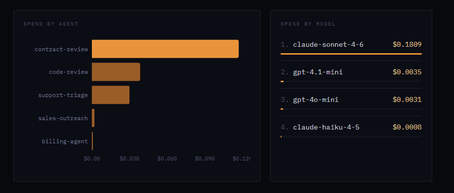
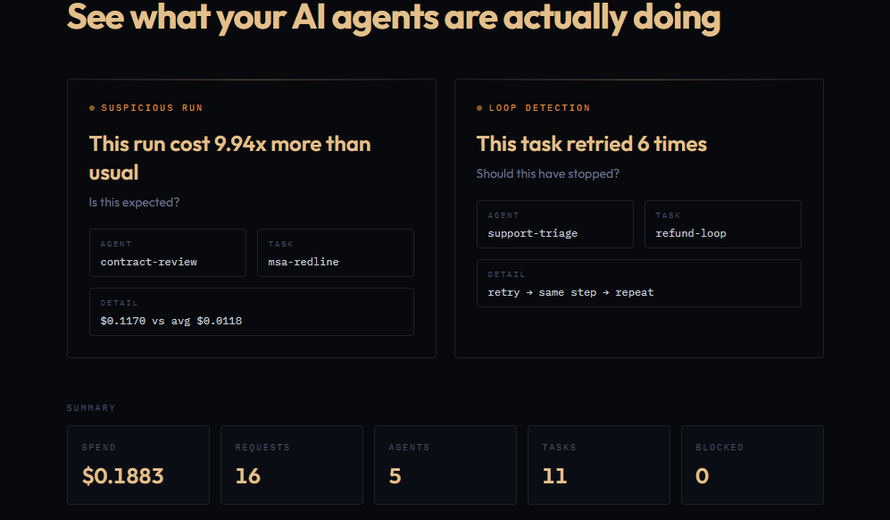
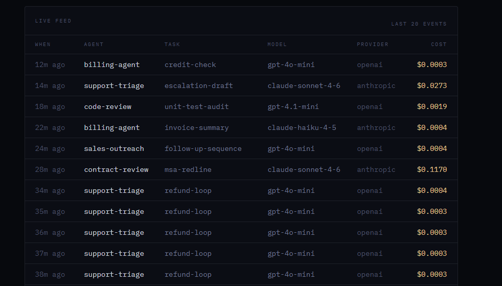

# Authority v7

**See what your AI agents are actually doing.**

Authority v7 is a local‑first, open‑source control plane for AI agents. It shows which agents are running, which tasks are consuming spend, where retry loops are happening, and which runs look suspicious across OpenAI and Anthropic.
---

 **[Live Demo](https://authority.bhaviavelayudhan.com/v7)**

---
## Screenshots
[](https://authority.bhaviavelayudhan.com/v7)

[](https://authority.bhaviavelayudhan.com/v7)

[](https://authority.bhaviavelayudhan.com/v7)

---

## Try it in 30 seconds

curl https://your-api/health
curl -X POST https://your-api/v1/dev/seed
curl https://your-api/v1/events

---
## What You Get

* **Spend Analysis:** Track costs by agent and by model.
* **Live Event Feed:** Real-time visibility into agent activities.
* **Anomaly Detection:** Identify suspicious runs and silent retry loops.
* **Persistence:** Local execution history that persists across sessions.


## Why This Exists

Agents retry silently, loop quietly, and burn money invisibly. Authority v7 makes that behavior visible immediately, giving you the control you need over autonomous workflows.

## Quick Start

### Install & Run

```bash
# Install dependencies
pnpm install

# Start the API service
pnpm --filter @authority/api dev

# Start the Web dashboard
pnpm --filter @authority/web dev
```
Then, open the dashboard locally in your browser once both services are running.

## Instrumenting Your Models

### OpenAI (TypeScript)

To track your OpenAI calls, wrap your client initialization with our SDK:

```typescript
import OpenAI from "openai";
import { init, instrumentOpenAI } from "@authority/sdk";

// Initialize the Authority SDK
init({ apiKey: "auth_dev_local" });

const client = instrumentOpenAI(
  new OpenAI({ apiKey: process.env.OPENAI_API_KEY }),
  {
    agent: "support-triage",
    task: "refund-check"
  }
);
```
### Anthropic (TypeScript)
To track your Anthropic calls, wrap your client initialization with our SDK:

```typeScript
import Anthropic from "@anthropic-ai/sdk";
import { init, instrumentAnthropic } from "@authority/sdk";

init({ apiKey: "auth_dev_local" });

const client = instrumentAnthropic(
  new Anthropic({ apiKey: process.env.ANTHROPIC_API_KEY }),
  {
    agent: "code-review",
    task: "patch-analysis"
  }
);
```
## Dashboard Insights
Financials: Total spend and spend breakdowns.

Volume: Request volume tracking.

Organization: Grouping by Agents and Tasks.

History: Recent executions and full logs.

Alerts: Immediate visibility into suspicious runs and retry loops.

## Storage
Authority v7 is local‑first:

SQLite: Uses SQLite by default for easy setup.

Persistence: Logs persist across restarts.

Zero-Infra: No external infrastructure required to get started.

Note: Public demo deployments may use in‑memory storage for simplicity.

## Architecture
The system follows a simple linear flow:
SDK → API → Storage → Dashboard

SDK: Instruments model calls.

API: Receives and processes events.

Storage: Persists execution data.

Dashboard: Visualizes behavior and metrics.

## Project Status
Version: Alpha

Philosophy: Local‑first

License: Open source (MIT)

## Repo Structure
Plaintext
apps/
  api/
  web/
packages/
  sdk/

## Contributing
We welcome contributions!

Keep changes small and focused.

Avoid breaking the core structure.

Please open an issue before submitting large architectural changes.

## License
This project is licensed under the MIT License.
